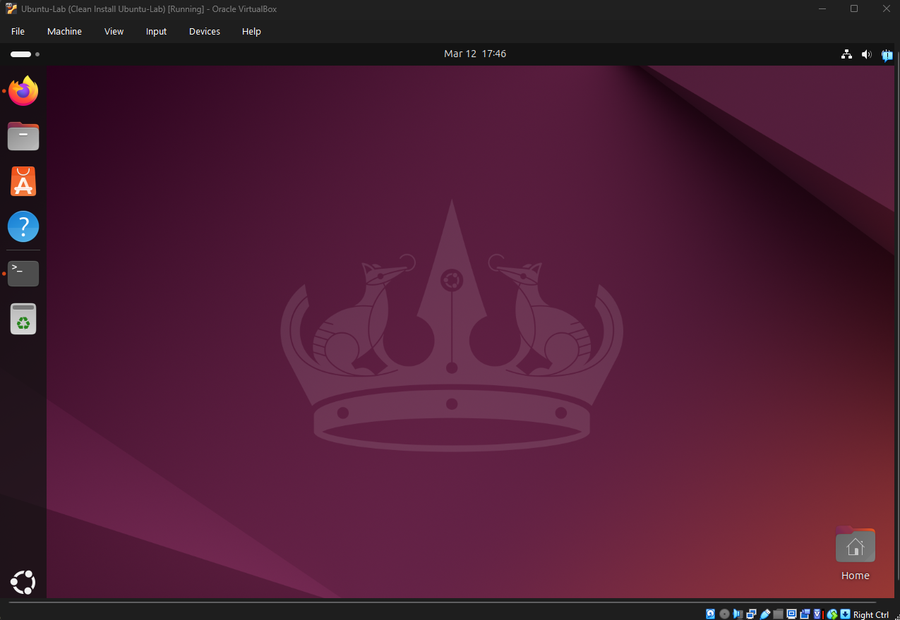
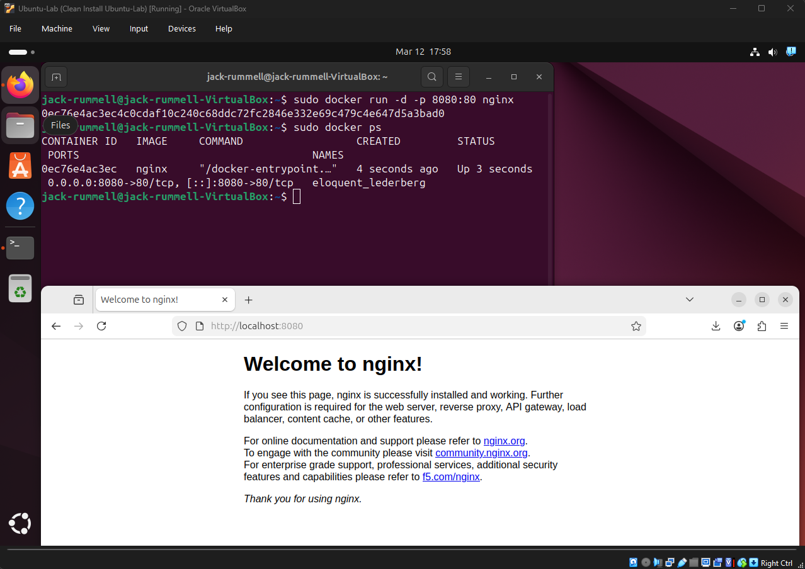
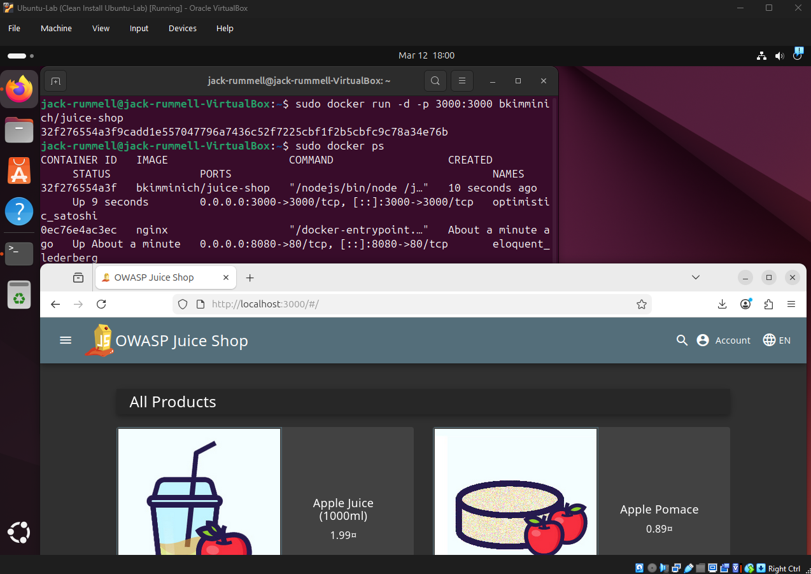

# Cybersecurity Virtualization & Container Lab

## Overview
This project demonstrates building a cybersecurity lab with virtual machines and containers. An Ubuntu virtual machine was deployed using VirtualBox and configured to run Docker containers. Within this environment, containerized applications were deployed and managed, including a deliberately vulnerable web application used for security testing and education.

Key objectives included:
- Build a virtual machine environment for cybersecurity experimentation  
- Understand the differences between virtual machines and containers  
- Install and configure Docker  
- Deploy containerized applications  
- Practice managing containers using Docker CLI  
- Safely run a vulnerable web application for security analysis  

## Technologies Used
- Oracle VirtualBox  
- Ubuntu 24.04 LTS  
- Docker  
- Nginx Web Server Container  
- OWASP Juice Shop Vulnerable Application  

## Environment Setup
A virtual machine was created using Oracle VirtualBox and configured with Ubuntu 24.04 LTS. This environment provides isolation from the host system and allows safe experimentation with containerized applications and vulnerable software.

**Key Steps:**  
- Installed VirtualBox and created an Ubuntu VM  
- Allocated CPU, RAM, and storage resources  
- Installed Ubuntu 24.04 LTS  
- Configured VM networking


## Docker Setup
Docker was installed inside the Ubuntu virtual machine to enable containerized application deployment.

**Commands Used:**  
```bash
sudo apt update
sudo apt install docker.io
sudo docker run hello-world
# The hello-world container verifies that Docker is installed and running correctly
```

## Container Deployment
A containerized web server was deployed using the official Nginx Docker image.

**Command Used:**
```bash
sudo docker run -d -p 8080:80 nginx
# This maps port 8080 on the VM to port 80 inside the container, allowing the web server to be accessed from a browser.
```


## Vulnerable Application Deployment
The OWASP Juice Shop application was deployed using Docker to simulate a vulnerable web application environment.

**Command Used:**
```bash
sudo docker run -d -p 3000:3000 bkimminich/juice-shop
# The vulnerable web application runs on port 3000 and can be accessed via a browser for safe security testing.
```


## Acknowledgments
Completed using a mentor-provided template; all work and screenshots reflect my own execution.
